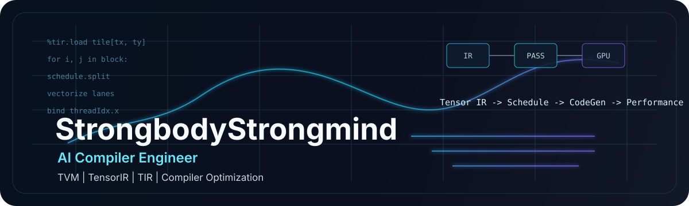
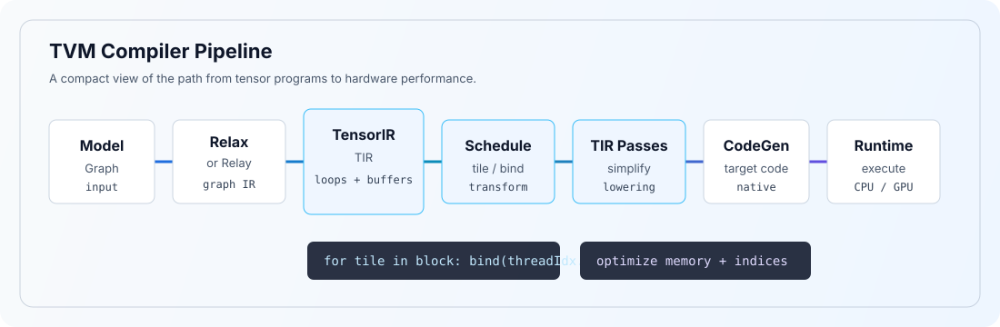

<p align="center">
  
</p>

# StrongbodyStrongmind

### AI Compiler Engineer

Focused on TVM, TensorIR, TIR and compiler performance optimization.

`TVM` / `TensorIR` / `TIR` / `Scheduling` / `Lowering` / `CodeGen` / `GPU Performance`

---

## About

I focus on AI compiler optimization, currently working deeply with TVM / TensorIR / TIR and performance-oriented compiler transformations.

My main interest is understanding optimization across the stack:

```text
Tensor IR -> Scheduling -> Compiler Passes -> Lowering -> CodeGen -> Hardware Performance
```

## TVM Compiler Stack

<p align="center">
  
</p>

## Current Focus

| Area | What I care about |
| --- | --- |
| TVM / TensorIR | Tensor program representation, schedule primitives, and lowering behavior |
| TIR Pass Design | Correctness-preserving transformations and compiler pipeline details |
| GPU Performance | Thread mapping, memory access, vectorization, and hardware-aware optimization |
| Code Generation | Bridging low-level IR to efficient executable kernels |
| Performance Analysis | Understanding why generated code behaves the way it does on real hardware |

## Featured Work

| Project | Focus |
| --- | --- |
| [tensortrail](https://github.com/StrongbodyStrongmind/tensortrail) | Educational end-to-end tensor compiler from Graph IR to Kernel IR, C CodeGen, native library generation, runtime execution, and NumPy-based verification. |
| [tvm](https://github.com/StrongbodyStrongmind/tvm) | Apache TVM fork used for studying and contributing to real TensorIR / TIR compiler optimization problems. |
| [gcc-x86-prefetch-opt](https://github.com/StrongbodyStrongmind/gcc-x86-prefetch-opt) | Compiler optimization foundation work around x86 prefetch behavior and hardware-aware backend reasoning. |

## TVM / TIR Optimization Work

Areas I am working on:

```text
TIR transformations
Index simplification and canonicalization
Tensor scheduling
Memory access optimization
GPU thread mapping
Vectorization
Operator performance optimization
Hardware-aware compiler behavior
```

## Open Source

Apache TVM:

| PR | Status | Area |
| --- | --- | --- |
| [apache/tvm#20265](https://github.com/apache/tvm/pull/20265) | Open | TIR lowering: ignore None-valued pragma annotations to avoid invalid AttrStmt values. |

## Tech Stack

| Category | Tools |
| --- | --- |
| Languages | C++, Python, C |
| Compiler | TVM, TensorIR, TIR |
| Systems | Linux, Git |
| Performance | GPU, SIMT, Profiling |

## Activity

I keep the profile intentionally focused: project work, compiler notes, and open-source contributions matter more here than badge walls or dynamic cards.

---

<p align="center">
  <sub>IR -> Schedule -> CodeGen -> Performance.</sub>
</p>
